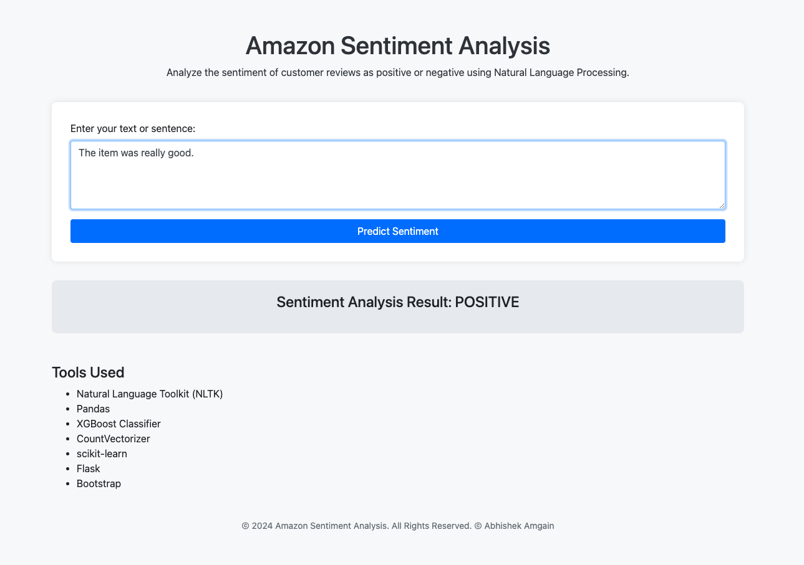
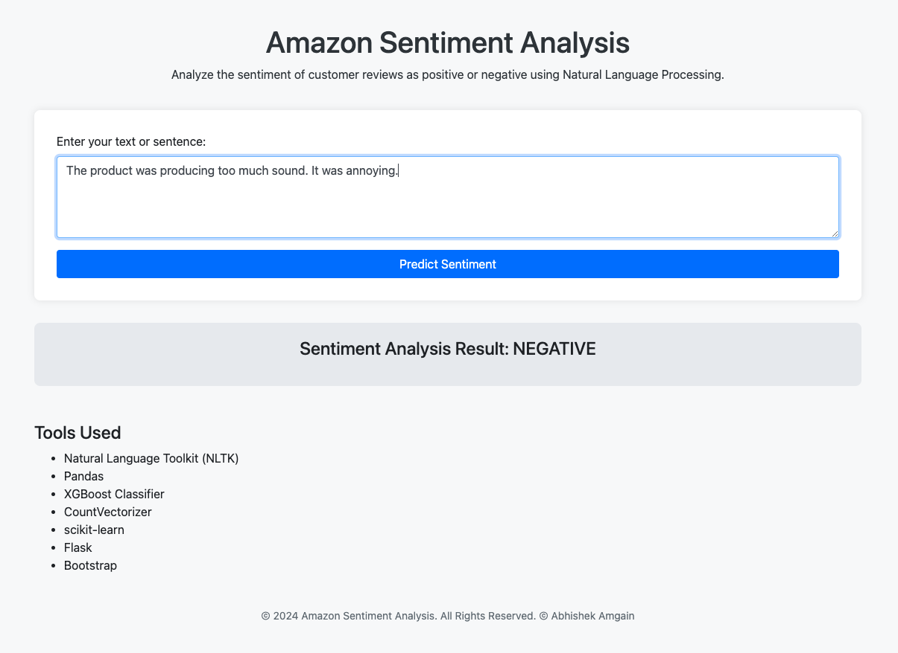

# Amazon Product Feedback Sentiment Analyzer

This is a Natural Language Processing (NLP)-based web application designed to analyze Amazon product feedback on the Amazon Echo product. The application classifies feedback as positive or negative, helping users gauge the overall sentiment of product reviews. Built using Flask, NLTK, and XGBoost, this tool utilizes advanced machine learning and text-processing techniques to accurately interpret customer experiences.

## Table of Contents

- [Features](#features)
- [Tech Stack](#tech-stack)
- [Installation](#installation)
- [Usage](#usage)
- [Screenshot](#screenshot)

## Features

- **Sentiment Analysis**: Determines if a product review is positive or negative.
- **User Interface**: Simple and responsive UI using HTML and CSS for easy navigation and feedback interpretation.

## Tech Stack

- **Backend**: Flask
- **Machine Learning**: NLTK, XGBoost
- **Data Preprocessing**: MinMaxScaler, CountVectorizer
- **Frontend**: HTML, CSS

## Installation

1. **Clone the repository:**
   ```bash
   git clone https://github.com/amgaina/amazon_sentiment_analysis.git
   cd amazon_sentiment_analysis
   ```
2. **Create and activate a virtual environment**

```bash
python3 -m venv env
source env/bin/activate  # On Windows use `env\Scripts\activate`
```

3. **Install Dependencies**

```bash
pip install -r requirements.txt
```

4. **Run the application**

```bash
python main.py
```

## Usage

1. Enter Product Feedback: Input your Amazon product feedback in the provided text field.
2. Analyze Sentiment: Click the ‘Predict Sentiment
   ’ button to process the feedback.
3. View Results: The app will display whether the feedback is positive or negative.

## Screenshot



